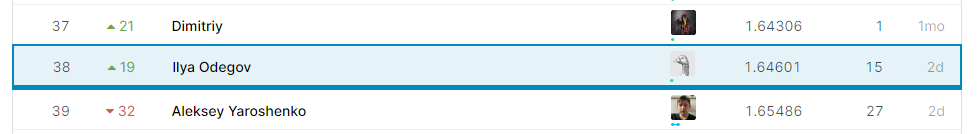

# made_cv_contest_2
# Описание решения, которое получило лучший *score* на *kaggle*.

 Обучение проводилось локально. В качестве рабочей машины использовался:
  * *Acer Nitro 5 Intel i5-9300H 2.40GHz 8GB Ram NVIDIA GeForce GTX 1650 4GB*.

 Так же использовался *colab.research.google.com*.

 В качесте базовой модели была обучена модель предложенная преподавателями. Параметры обученияпредставлены ниже:

* *AdamW(lr=3e-4, weight_decay=0.05);*
  * *ReduceLROnPlateau(patience=2, factor=0.1**0.5);*
  * *n_epochs_det* = 30;*
  * *n_epochs_rec* = 20;*
 
 В результате был получен *score* не сильно отличающийся от *baseline* (0.95893). Для улучшения результатов был проведен поиск лучшей модели ответственной за предсказание нормеров. Были проверены модели:

 * *Resnet34 + GRU;*
 * *Resnet50 + GRU;*
 * *Resnext50_32x4d + GRU.*
 
 Лучший результат показала сеть *Resnext50_32x4d + GRU* был получен score 0.72551. Для улучшения качества обучения было принято решение увеличить количество картинок на которых происходит обучени модели детекции и предсказания.

 Для увеличения количества картинок, с которыми мог работать *pipeline* обучения разработан скрипт, в котором в случайном порядке выбирались *n* аугментация из списка (*Gray, Blur, Sepia, GaussianNoise, Salt&Paper noise, Cutout*). К аугментированной картинке применялся *Crop*. *Crop* был реализован таким образом, что номер всегда оставался в полученной в результате обрезания области. Примененные изменения отражались так же в *json* файле.\
 
 Увеличение количество картинок позволило улучшить *score* до 0.70480. В качестве модели детекции применялся *Unet* В качестве модели распознования *Resnext50_32x4d + GRU*. Дальнейший подбор гиперпараметров не давал улучшения результатов. Поээтому было принято решения изменить модель ответственную за детекцию изображения. За основу новой модели был взят [tutorial](https://pytorch.org/tutorials/intermediate/torchvision_tutorial.html) с сайта Pytorch

 Ниже прикреплен скриншот лучшего *score* и моей позиции на *leaderboad*:

